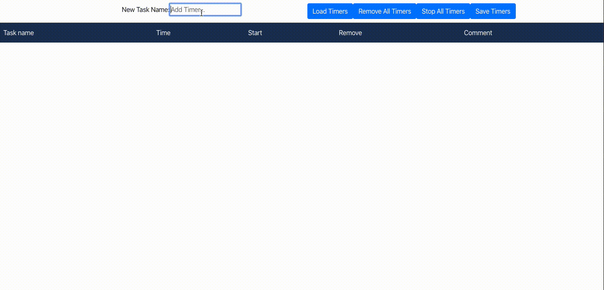

# Multiple timers in React + Express

Demo:


To setup:
```bash
yarn
```

To run, run this to start the React App:
```bash
yarn start
```
Then run the following to start the Express server:
```bash
node ./src/server.js
```